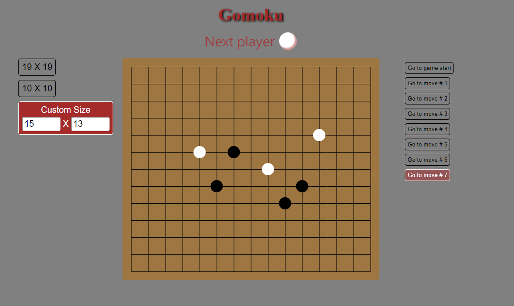

# Gomoku

## [Demo](https://lagom0327.github.io/Gomoku/)
## Introduction
使用 `create-react-app` 建立五子棋小遊戲

## Screenshot



## File Structure
```
.
├── public
│   ├── favicon.ico
│   ├── index.html
│   ├── manifest.json
│   └── robots.txt
├── src
│   ├── components
│   │   ├── Board.js
│   │   ├── Controlsize.js
│   │   ├── GameSteps.js
│   │   └── Square.js
│   ├── scss
│   │   ├── Board.scss
│   │   ├── Controlsize.css
│   │   ├── GameSteps.scss
│   │   ├── index.scss
│   │   └── param.scss
│   ├── index.js
│   ├── reset.css
│   ├── serviceWorker.js
│   └── setupTests.js
├── .eslintrcignore
├── .eslintrc.js
├── .gitignore
├── package.json
├── package-lock.json
├── README.md
└── screenshot.png
```
## User story
- 可以選擇或自訂棋盤尺寸
  - 最小 `5 X 5`
  - 最大 `19 X 24`
- 可以跳回以往任何一步
